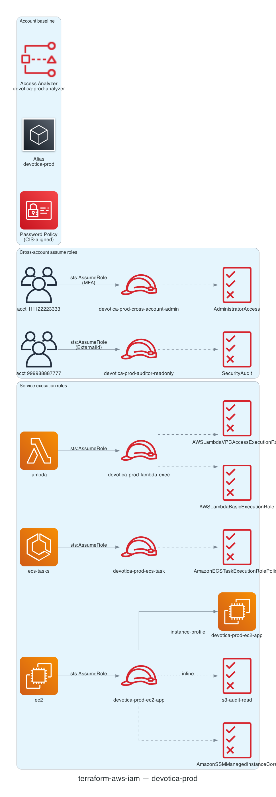

# terraform-aws-iam

[](https://github.com/devotica-labs/terraform-aws-iam/actions/workflows/ci.yml)
[](https://github.com/devotica-labs/terraform-aws-iam/actions/workflows/release.yml)
[](LICENSE)

Production-grade AWS IAM module with a unified role surface for service
execution roles (Lambda/EC2/ECS/EKS) and cross-account assume roles, plus an
optional account-level baseline (password policy, alias, Access Analyzer).

This module follows the Devotica module shape: Apache-2.0 licensed, validated
inputs, plan-only unit + contract tests, terraform-docs auto-update, central
reusable CI from `devotica-labs/terraform-shared-config`, and signed releases
with CycloneDX SBOMs.

<!-- BEGIN_ARCH -->



<sub>Generated by `.github/workflows/architecture-diagram.yml` on every push to main. Do not edit the image by hand — change the Terraform code in `examples/complete/` and the bot will regenerate it.</sub>

<!-- END_ARCH -->

## Scope

| Surface | Covered |
|---|---|
| Service execution roles (Lambda, EC2, ECS, EKS) | ✅ |
| Cross-account assume roles (MFA + ExternalId) | ✅ |
| EC2 instance profiles | ✅ (opt-in per role) |
| Inline + managed policy attachments | ✅ |
| Permissions boundaries | ✅ |
| Account password policy (CIS v3.0 §1.5–1.11) | ✅ |
| Account alias | ✅ |
| IAM Access Analyzer (CIS 1.20) | ✅ |
| IAM users / groups | ❌ (use AWS SSO / IAM Identity Center) |
| GitHub OIDC provider + workload identity | ❌ (planned for v0.2) |
| SCPs / Organization policies | ❌ (out of scope; use a dedicated org module) |

## Quick start

```hcl
module "iam" {
  source  = "devotica-labs/iam/aws"
  version = "~> 0.1"

  roles = {
    lambda-exec = {
      trust_type          = "service"
      trust_principals    = ["lambda.amazonaws.com"]
      managed_policy_arns = ["arn:aws:iam::aws:policy/service-role/AWSLambdaBasicExecutionRole"]
    }
  }

  tags = {
    Environment = "production"
    Project     = "platform"
    Owner       = "cloud-team@example.com"
    CostCenter  = "PLATFORM"
    ManagedBy   = "Terraform"
    Repo        = "https://github.com/your-org/your-infra"
  }
}
```

See [`examples/complete`](examples/complete/main.tf) for the full surface
(EC2 instance profile, ECS task role, cross-account admin with MFA,
third-party auditor with ExternalId, password policy, alias, Access Analyzer).

## Defaults that matter

- **Password policy**: 14-char min, mixed case + numbers + symbols, 90-day
  max age, 24-password history. Aligned with CIS v3.0 and RBI cyber-security
  guidance.
- **max_session_duration**: 3600 (1h). Override per-role up to 43200 (12h).
- **path**: `/`. Override per-role for organisational scoping
  (`/service-roles/`, `/cross-account/`, etc.).
- **Tags**: every taggable resource gets `ManagedBy = "terraform"` and
  `Module = "terraform-aws-iam"` merged with `var.tags`.

## Governance

- CI runs the central reusable workflow from `devotica-labs/terraform-shared-config`:
  fmt, validate, tflint, tfsec, gitleaks, terraform-docs, conftest against
  `devotica-labs/terraform-policies`, terraform test, checkov, examples build.
- Releases are cut by `release-please` on Conventional Commits. Each release
  is keyless-signed via cosign and ships a CycloneDX SBOM.

<!-- BEGIN_TF_DOCS -->


## Usage

### Basic

```hcl
# ---------------------------------------------------------------------------
# Provider block — CI-friendly skip flags + non-AWS-shaped placeholder creds.
#
# The skip_* flags let `terraform plan` run without calling STS
# GetCallerIdentity / EC2 IMDS. The access_key / secret_key values are
# intentionally NOT AWS-shaped (no AKIA / ASIA prefix, no 40-char base64)
# so gitleaks does not flag them as a leaked AWS access key — they exist
# only to satisfy the provider credential chain.
#
# In a real deployment, drop the skip_* flags AND the placeholder creds,
# and rely on your normal credential chain (OIDC role, profile,
# assume-role, etc.).
# ---------------------------------------------------------------------------
provider "aws" {
  region                      = "ap-south-1"
  access_key                  = "not-a-real-aws-key"
  secret_key                  = "not-a-real-aws-secret"
  skip_credentials_validation = true
  skip_metadata_api_check     = true
  skip_requesting_account_id  = true
}

# Uses local path during development.
# Change to Registry source after first release:
#   source  = "devotica-labs/iam/aws"
#   version = "~> 1.0"

module "iam" {
  source = "../.."

  roles = {
    lambda-basic-exec = {
      trust_type       = "service"
      trust_principals = ["lambda.amazonaws.com"]
      managed_policy_arns = [
        "arn:aws:iam::aws:policy/service-role/AWSLambdaBasicExecutionRole",
      ]
      description = "Lambda basic execution role."
    }
  }

  # Foundation Plan §15.2 — six mandatory tags on every resource.
  # In a real deployment, replace these values with your environment's.
  tags = {
    Environment = "example"
    Project     = "terraform-aws-iam"
    Owner       = "platform@devotica.com"
    CostCenter  = "PLATFORM-OSS"
    ManagedBy   = "Terraform"
    Repo        = "https://github.com/devotica-labs/terraform-aws-iam"
  }
}
```

### Complete

```hcl
# ---------------------------------------------------------------------------
# Provider block — CI-friendly skip flags + non-AWS-shaped placeholder creds.
# ---------------------------------------------------------------------------
provider "aws" {
  region                      = "ap-south-1"
  access_key                  = "not-a-real-aws-key"
  secret_key                  = "not-a-real-aws-secret"
  skip_credentials_validation = true
  skip_metadata_api_check     = true
  skip_requesting_account_id  = true
}

# Inline policy used by the EC2 role below — narrow read-only S3 access.
data "aws_iam_policy_document" "s3_audit_logs_read" {
  statement {
    sid       = "ReadAuditLogsBucket"
    effect    = "Allow"
    actions   = ["s3:GetObject", "s3:ListBucket"]
    resources = ["arn:aws:s3:::devotica-audit-logs", "arn:aws:s3:::devotica-audit-logs/*"]
  }
}

# Uses local path during development.
# Change to Registry source after first release:
#   source  = "devotica-labs/iam/aws"
#   version = "~> 1.0"

module "iam" {
  source = "../.."

  name_prefix = "devotica-prod-"

  roles = {
    # --- Lambda execution role ---
    lambda-exec = {
      trust_type       = "service"
      trust_principals = ["lambda.amazonaws.com"]
      managed_policy_arns = [
        "arn:aws:iam::aws:policy/service-role/AWSLambdaBasicExecutionRole",
        "arn:aws:iam::aws:policy/service-role/AWSLambdaVPCAccessExecutionRole",
      ]
      description = "Lambda execution role (VPC-attached)."
    }

    # --- EC2 instance role with instance profile ---
    ec2-app = {
      trust_type              = "service"
      trust_principals        = ["ec2.amazonaws.com"]
      create_instance_profile = true
      managed_policy_arns = [
        "arn:aws:iam::aws:policy/AmazonSSMManagedInstanceCore",
      ]
      inline_policies = {
        s3-audit-read = data.aws_iam_policy_document.s3_audit_logs_read.json
      }
      description = "EC2 app instance role — SSM + read-only audit log bucket."
    }

    # --- ECS task role ---
    ecs-task = {
      trust_type       = "service"
      trust_principals = ["ecs-tasks.amazonaws.com"]
      managed_policy_arns = [
        "arn:aws:iam::aws:policy/service-role/AmazonECSTaskExecutionRolePolicy",
      ]
      description = "ECS task execution role."
    }

    # --- Cross-account admin role (MFA-gated) ---
    cross-account-admin = {
      trust_type           = "aws"
      trust_principals     = ["arn:aws:iam::111122223333:root"]
      require_mfa          = true
      max_session_duration = 3600
      managed_policy_arns  = ["arn:aws:iam::aws:policy/AdministratorAccess"]
      description          = "Assumable by management-account admins with MFA."
    }

    # --- Third-party auditor role (ExternalId + read-only) ---
    auditor-readonly = {
      trust_type           = "aws"
      trust_principals     = ["arn:aws:iam::999988887777:role/auditor"]
      external_id          = "devotica-audit-2026"
      max_session_duration = 3600
      managed_policy_arns  = ["arn:aws:iam::aws:policy/SecurityAudit"]
      description          = "Third-party security auditor — ExternalId-locked."
    }
  }

  # --- Account baseline ---
  manage_account_password_policy = true
  password_policy = {
    minimum_password_length   = 14
    max_password_age          = 90
    password_reuse_prevention = 24
  }

  account_alias = "devotica-prod"

  enable_iam_access_analyzer = true
  access_analyzer_name       = "devotica-prod-analyzer"
  access_analyzer_type       = "ACCOUNT"

  tags = {
    Environment = "production"
    Project     = "platform"
    Owner       = "cloud-team@devotica.com"
    CostCenter  = "PLATFORM"
    ManagedBy   = "Terraform"
    Repo        = "https://github.com/devotica-labs/terraform-aws-iam"
  }
}
```

## Requirements

| Name | Version |
|------|---------|
| <a name="requirement_terraform"></a> [terraform](#requirement\_terraform) | >= 1.6.0, < 2.0.0 |
| <a name="requirement_aws"></a> [aws](#requirement\_aws) | ~> 6.44 |
## Providers

| Name | Version |
|------|---------|
| <a name="provider_aws"></a> [aws](#provider\_aws) | ~> 6.44 |
## Resources

| Name | Type |
|------|------|
| [aws_accessanalyzer_analyzer.this](https://registry.terraform.io/providers/hashicorp/aws/latest/docs/resources/accessanalyzer_analyzer) | resource |
| [aws_iam_account_alias.this](https://registry.terraform.io/providers/hashicorp/aws/latest/docs/resources/iam_account_alias) | resource |
| [aws_iam_account_password_policy.this](https://registry.terraform.io/providers/hashicorp/aws/latest/docs/resources/iam_account_password_policy) | resource |
| [aws_iam_instance_profile.this](https://registry.terraform.io/providers/hashicorp/aws/latest/docs/resources/iam_instance_profile) | resource |
| [aws_iam_role.this](https://registry.terraform.io/providers/hashicorp/aws/latest/docs/resources/iam_role) | resource |
| [aws_iam_role_policy.inline](https://registry.terraform.io/providers/hashicorp/aws/latest/docs/resources/iam_role_policy) | resource |
| [aws_iam_role_policy_attachment.managed](https://registry.terraform.io/providers/hashicorp/aws/latest/docs/resources/iam_role_policy_attachment) | resource |
## Inputs

| Name | Description | Type | Default | Required |
|------|-------------|------|---------|:--------:|
| <a name="input_access_analyzer_name"></a> [access\_analyzer\_name](#input\_access\_analyzer\_name) | Name for the IAM Access Analyzer. Ignored when enable\_iam\_access\_analyzer = false. | `string` | `"default-analyzer"` | no |
| <a name="input_access_analyzer_type"></a> [access\_analyzer\_type](#input\_access\_analyzer\_type) | Analyzer scope. "ACCOUNT" inspects only this account; "ORGANIZATION" inspects every account in the AWS Organization (run from the org management account or a delegated administrator). | `string` | `"ACCOUNT"` | no |
| <a name="input_account_alias"></a> [account\_alias](#input\_account\_alias) | Account alias (e.g. "devotica-prod"). Must be globally unique across AWS. Empty string (default) means do not manage. | `string` | `""` | no |
| <a name="input_enable_iam_access_analyzer"></a> [enable\_iam\_access\_analyzer](#input\_enable\_iam\_access\_analyzer) | Create an IAM Access Analyzer in this region. Required for CIS 1.20. | `bool` | `false` | no |
| <a name="input_manage_account_password_policy"></a> [manage\_account\_password\_policy](#input\_manage\_account\_password\_policy) | Manage the account-level IAM password policy. Only one password policy can exist per AWS account — set this on exactly one stack. | `bool` | `false` | no |
| <a name="input_name_prefix"></a> [name\_prefix](#input\_name\_prefix) | Optional string prepended to every role name (e.g. "devotica-prod-"). Useful for multi-tenant accounts. Leave empty for no prefix. | `string` | `""` | no |
| <a name="input_password_policy"></a> [password\_policy](#input\_password\_policy) | Account password policy settings. Ignored when manage\_account\_password\_policy = false. | <pre>object({<br/>    minimum_password_length        = optional(number, 14)<br/>    require_lowercase_characters   = optional(bool, true)<br/>    require_uppercase_characters   = optional(bool, true)<br/>    require_numbers                = optional(bool, true)<br/>    require_symbols                = optional(bool, true)<br/>    allow_users_to_change_password = optional(bool, true)<br/>    max_password_age               = optional(number, 90)<br/>    password_reuse_prevention      = optional(number, 24)<br/>    hard_expiry                    = optional(bool, false)<br/>  })</pre> | `{}` | no |
| <a name="input_roles"></a> [roles](#input\_roles) | Map of IAM roles to create. Key = role name (after name\_prefix). See module README for the per-role schema and examples for Lambda/EC2/ECS/EKS/cross-account. | <pre>map(object({<br/>    trust_type               = string<br/>    trust_principals         = list(string)<br/>    managed_policy_arns      = optional(list(string), [])<br/>    inline_policies          = optional(map(string), {})<br/>    path                     = optional(string, "/")<br/>    max_session_duration     = optional(number, 3600)<br/>    permissions_boundary_arn = optional(string)<br/>    create_instance_profile  = optional(bool, false)<br/>    require_mfa              = optional(bool, false)<br/>    external_id              = optional(string)<br/>    description              = optional(string, "")<br/>  }))</pre> | `{}` | no |
| <a name="input_tags"></a> [tags](#input\_tags) | Additional tags merged onto every taggable resource. | `map(string)` | `{}` | no |
## Outputs

| Name | Description |
|------|-------------|
| <a name="output_access_analyzer_arn"></a> [access\_analyzer\_arn](#output\_access\_analyzer\_arn) | ARN of the IAM Access Analyzer. Empty string when enable\_iam\_access\_analyzer = false. |
| <a name="output_access_analyzer_id"></a> [access\_analyzer\_id](#output\_access\_analyzer\_id) | ID of the IAM Access Analyzer. Empty string when enable\_iam\_access\_analyzer = false. |
| <a name="output_account_alias"></a> [account\_alias](#output\_account\_alias) | Account alias managed by this module. Empty string when unmanaged. |
| <a name="output_account_password_policy_managed"></a> [account\_password\_policy\_managed](#output\_account\_password\_policy\_managed) | Whether this module is managing the account-level password policy. |
| <a name="output_instance_profile_arns"></a> [instance\_profile\_arns](#output\_instance\_profile\_arns) | Map of role key → EC2 instance profile ARN. Only contains roles where create\_instance\_profile = true. |
| <a name="output_instance_profile_names"></a> [instance\_profile\_names](#output\_instance\_profile\_names) | Map of role key → EC2 instance profile name. Only contains roles where create\_instance\_profile = true. |
| <a name="output_role_arns"></a> [role\_arns](#output\_role\_arns) | Map of role key → IAM role ARN. |
| <a name="output_role_ids"></a> [role\_ids](#output\_role\_ids) | Map of role key → IAM role ID (stable role identifier, e.g. for IAM Policy condition keys). |
| <a name="output_role_names"></a> [role\_names](#output\_role\_names) | Map of role key → IAM role name (after name\_prefix). |
<!-- END_TF_DOCS -->

## License

Apache-2.0. See [`LICENSE`](LICENSE) and [`NOTICE`](NOTICE).
